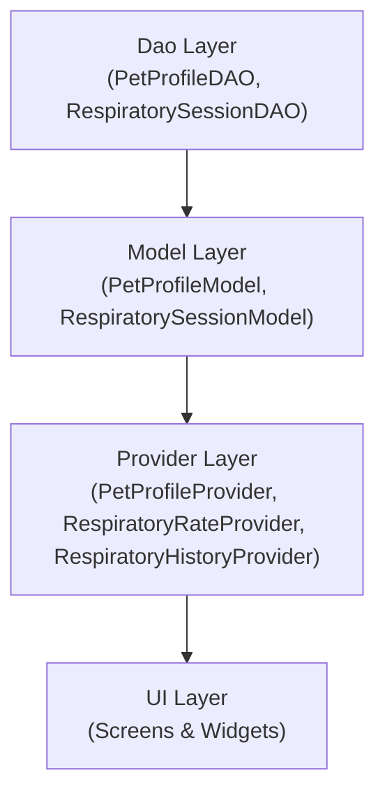
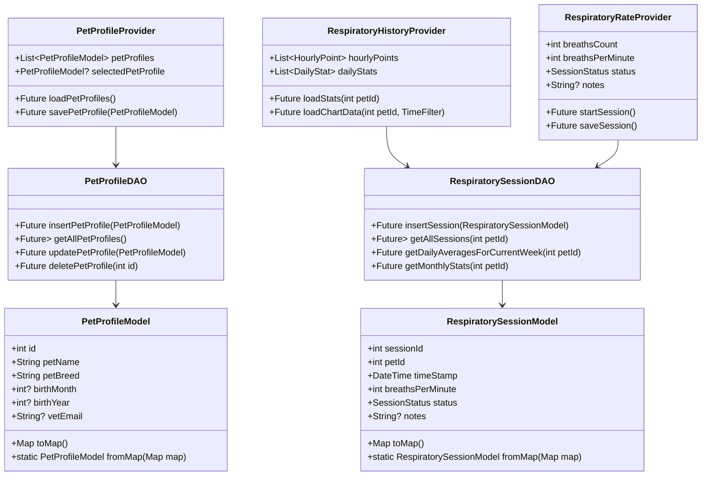
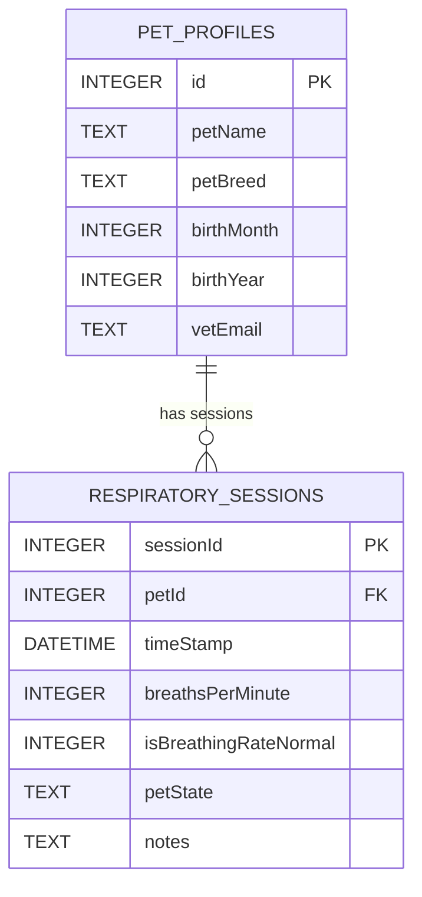

# CHeart
CHeart is a Flutter application that helps owners monitor resting respiratory rates for pets with heart disease. Users can create profiles, record breathing sessions, visualize trends, and export data for veterinary review.

  

---

## Table of Contents
1. [Features](#features)
2. [Tech Stack & Tools](#tech-stack--tools)
3. [Screenshots & Demo (Coming soon!)](#screenshots--demo-coming-soon)
4. [Architecture & Diagrams](#architecture--diagrams)

---

## Features
- **Profile Management**  
  - Create, edit, delete, and switch between multiple pet profiles (name, breed, birth month/year, veterinarian email).

- **Profile Photo Upload**  
  - Pick an image from the gallery or camera and crop it before saving as your pet’s avatar.

- **Respiratory Rate Tracker**  
  - Tap the heart-shaped button for 30 seconds to record breaths.  
  - Calculates breaths-per-minute (BPM); number of breaths * 2 = BPM.

- **Post-Session Modal**  
  - Displays breaths-per-minute (BPM) and select pet's status (`“sleeping”` vs. `“at rest”`) once the timer ends.  
  - High-BPM warning banner appears for BPM ≥ 40.

- **Data Visualization**  
  - Visualize breathing data over time with hourly, weekly, and monthly views.  
  - “No data” placeholders when a pet has no recorded sessions.

- **Export Data**  
  - Generate XML or CSV exports of respiratory sessions.  
  - Opens email client with the chosen file attached for easy sharing with a veterinarian.

---

## Tech Stack & Tools
- **Framework & Language**  
  - Flutter 3.8.0 / Dart

- **State Management**  
  - Provider

- **Local Persistence**  
  - sqflite (SQLite)

- **Charts & Data Visualization**  
  - fl_chart

- **Continuous Integration**  
  - GitHub Actions (Android emulator setup + `flutter test` + `flutter build`)

- **Testing**  
  - `flutter_test` (unit & widget tests)  
  - mockito (for provider/DAO mocking)  
  - sqflite_common_ffi (in-memory SQLite for DAO tests)

- **Email Integration**  
  - `url_launcher` (opens mailto links in the default email app)  
  - `flutter_email_sender` (sends emails with attachments directly from the app)  

- **Media Handling**  
  - `image_picker` (select photos from camera/gallery)  
  - `image_cropper` (inline image cropping)

---

## Screenshots & Demo (Coming soon!)

### Home Screen (Profile List)

*Manage multiple pet profiles from a single dashboard. Tap a profile card to select or edit.*

---

### Respiratory Rate Tracker

*Large tappable heart button in the center with a 30-second countdown. Tapping the heart increments breath count.*

---

### Post-Session Modal

*Displays BPM, allows selection of pet's status (“sleeping” vs. “at rest”). High-BPM (≥ 40) warning banner appears when triggered.*

---

### Graph Screen

*Line and bar charts visualize breathing data over different time scales. “No data” placeholders appear if no sessions exist for the selected range.*

---

## Architecture & Diagrams

### 1. Flow Chart

---

### 2. UML Class Diagram

---

### 3. E/R Diagram

